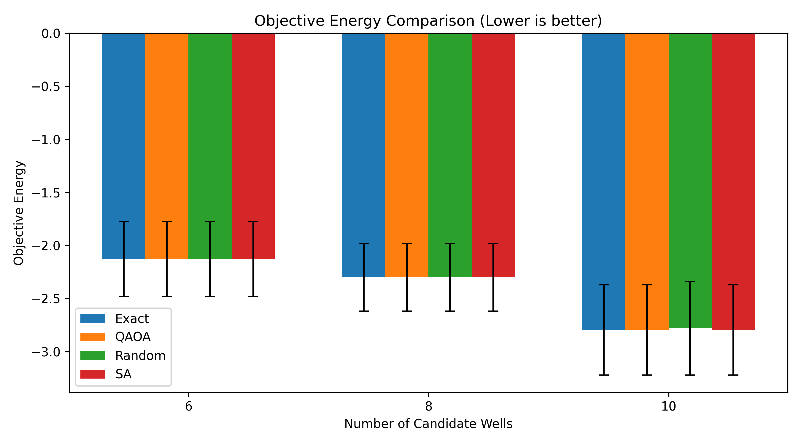
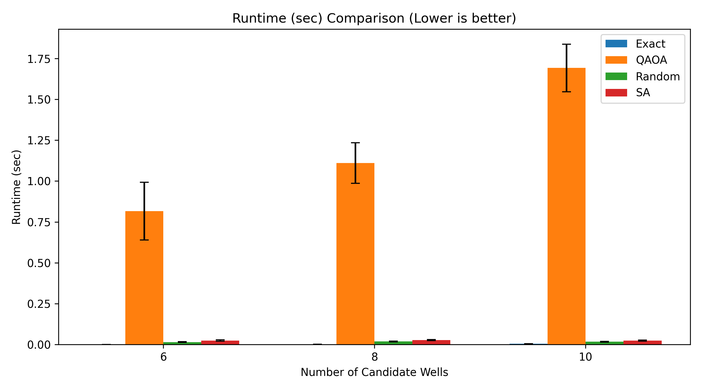

# 🧠 Quantum Reservoir Optimizer

Hybrid Quantum-Classical Optimization for Oil Reservoir Well Placement using QUBO and QAOA.

---

## 🚀 Overview

This project implements a hybrid optimization framework combining classical and quantum methods to solve oil reservoir well placement problems.

---

## ⚙️ Problem

We aim to select optimal wells while:

- Maximizing production
- Minimizing interference

This is formulated as a:

> Quadratic Unconstrained Binary Optimization (QUBO)

---

## 🧪 Methods

| Method | Type |
|--------|------|
| Exact | Optimal |
| SA | Classical |
| Random | Baseline |
| QAOA | Quantum |

---

## 📊 Results

### Energy Comparison

### Production

### Runtime

---

## ⚡ Key Insights

- QAOA matches classical performance for small-scale problems
- Exact solver is not scalable
- Quantum advantage may appear at larger scales

---

## 🧱 Project Structure
