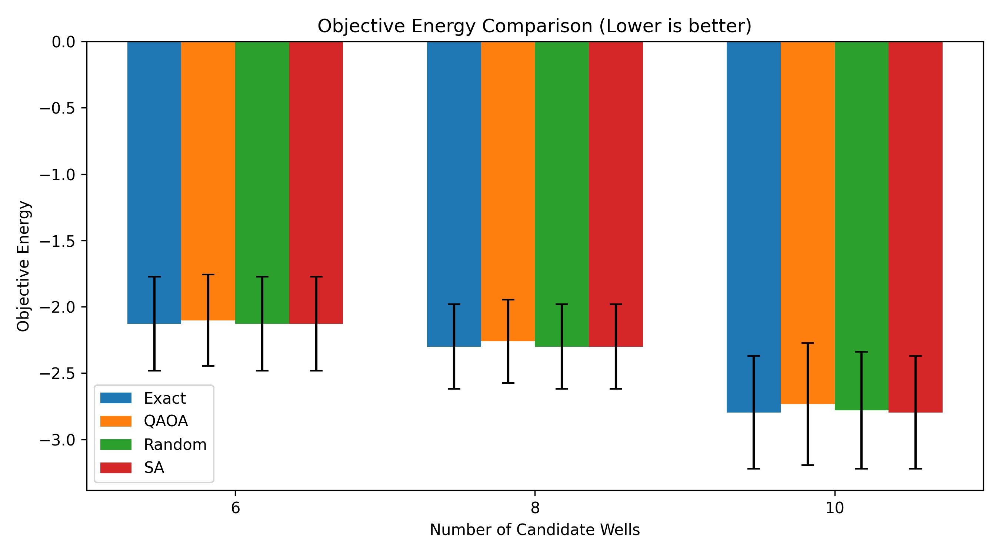
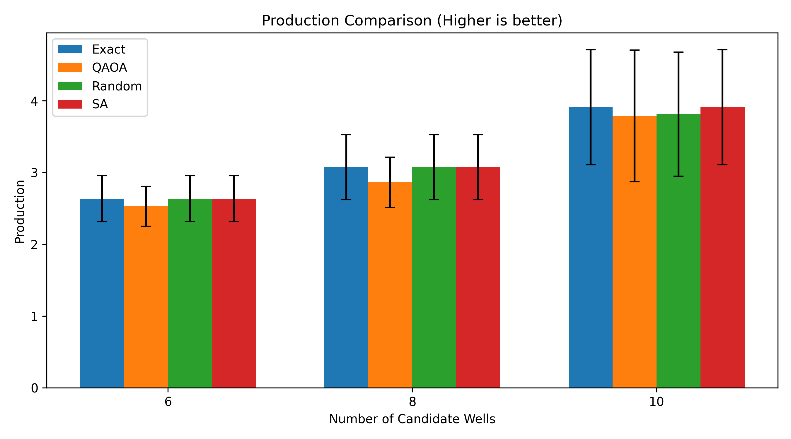
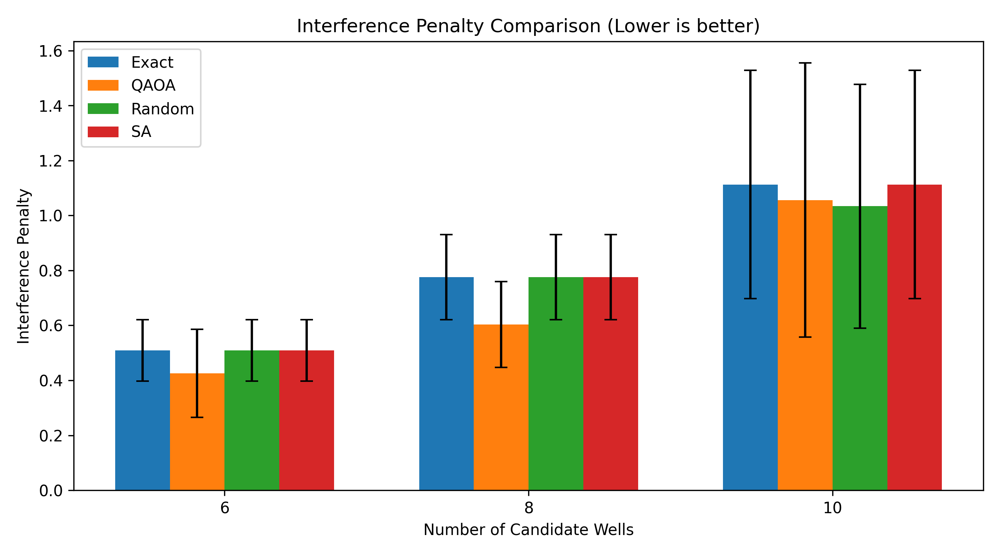
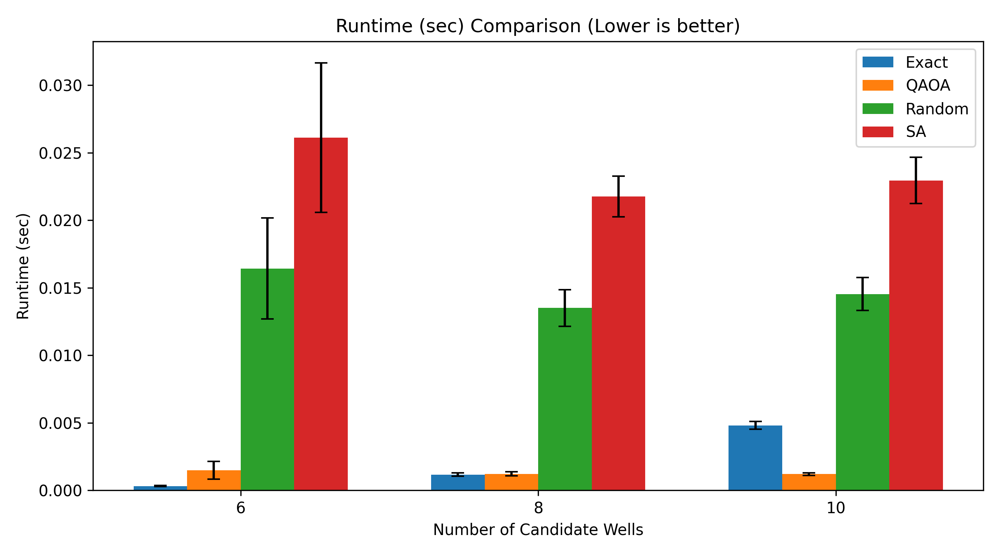

# Quantum–Classical Oil Reservoir Optimization

This project presents a hybrid quantum–classical framework for optimizing oil well placement using QUBO modeling and QAOA.

## 🔍 Overview

- Transform reservoir optimization into a QUBO problem
- Solve using Quantum Approximate Optimization Algorithm (QAOA)
- Benchmark against classical solvers:
  - Exact
  - Simulated Annealing (SA)
  - Random Search

## 📊 Results

The framework produces:
- Binary well placement decisions (0/1)
- Competitive optimization performance
- Scalable approach for combinatorial problems

## 📈 Example Results

### Energy Comparison


### Production Comparison


### Interference Comparison


### Runtime Comparison


## 🧠 Key Contribution

This work introduces a new paradigm for:
- Field development planning
- Reservoir optimization
- Capital allocation strategies

## 🚀 How to Run

```bash
python run_qaoa.py
python comparison.py
## 👤 Author
## 👤 Author

**Tareq Mageed**


Petroleum Engineer – Ministry of Oil, Iraq  
GitHub: https://github.com/sumerian29  
[LinkedIn: https://linkedin.com/in/your-profile](https://www.linkedin.com/in/tariq-al-kraimy-5b5301a2/)
